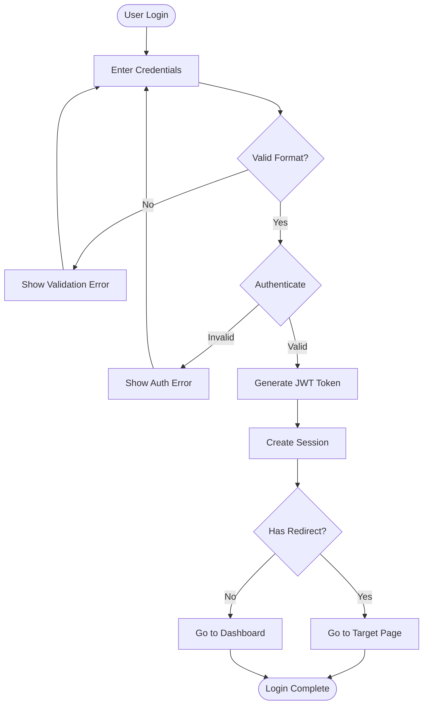

# Flowchart Prompts

## Use Cases
- Documenting algorithms and program logic
- Mapping user workflows and journeys
- Visualizing decision-making processes
- Planning system architecture and data flow
- Creating onboarding or troubleshooting guides

## Generate From Existing Files

### Analyze Entire Project
- "Analyze the main application flow from src/index.js and create a flowchart showing the startup sequence, initialization, and main execution path"
- "Review the authentication system across auth/ folder and generate a flowchart of the complete login/signup process"
- "Examine the deployment scripts in scripts/ folder and create a flowchart showing the CI/CD pipeline from commit to production"

### Analyze Specific Feature
- "Analyze the checkout process in src/features/checkout/ and create a flowchart showing all steps, validations, and payment handling"
- "Review the form validation logic in src/components/Form.js and generate a flowchart of the validation workflow"
- "Examine the file upload feature in src/services/upload.js and create a flowchart showing the upload, processing, and storage flow"

### Analyze Code Flow
- "Analyze the error handling in src/middleware/errorHandler.js and create a flowchart showing how different error types are processed"
- "Review the data fetching logic in src/hooks/useData.js and generate a flowchart of the loading, success, and error states"
- "Examine the authentication middleware in src/middleware/auth.js and create a flowchart showing the token validation process"

## Example Prompts

### Process Workflows
1. "Create a flowchart for user registration with email verification and profile setup steps"
2. "Generate a flowchart showing e-commerce order processing from cart to delivery"
3. "Design a flowchart for content approval workflow with review, edit, and publish stages"

### Algorithm Design
1. "Build a flowchart for binary search algorithm showing comparisons and decisions"
2. "Create a flowchart for input validation with multiple conditions and error messages"
3. "Design a flowchart for password reset process including email verification"

### System Architecture
1. "Generate a flowchart showing API request flow through authentication, routing, and response"
2. "Create a flowchart for data synchronization between client, API, and database"
3. "Design a flowchart showing microservices communication with message queues"

## Sample Diagram

## Key Features
- **Direction**: `TD` (top-down), `LR` (left-right), `BT` (bottom-top), `RL` (right-left)
- **Shapes**: 
  - `[Rectangle]` - Process
  - `([Oval])` - Start/End
  - `{Diamond}` - Decision
  - `[(Database)]` - Data store
  - `[[Subprocess]]` - Subprocess
- **Arrows**: `-->` solid, `-.->` dotted, `==>` thick
- **Labels**: `-->|Label|` for edge text
- **Styling**: Define classes with `classDef` and apply with `:::`

## Tips
1. Start with the main happy path before adding error handling branches
2. Use consistent shapes - ovals for start/end, diamonds for decisions, rectangles for actions
3. Keep decision nodes simple with yes/no or clear options
4. Add descriptive labels on decision branches to clarify paths
5. Limit flowchart to 10-15 nodes for clarity, break complex flows into sub-diagrams
6. Use subgraphs to group related steps together
